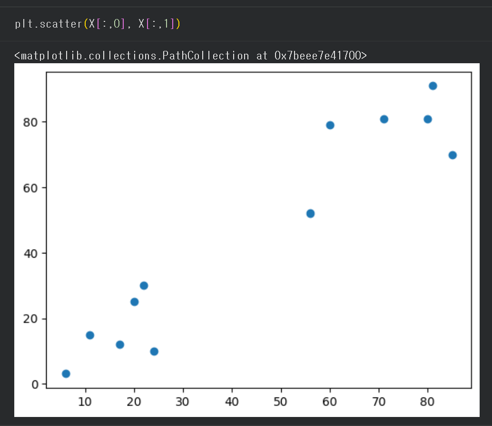
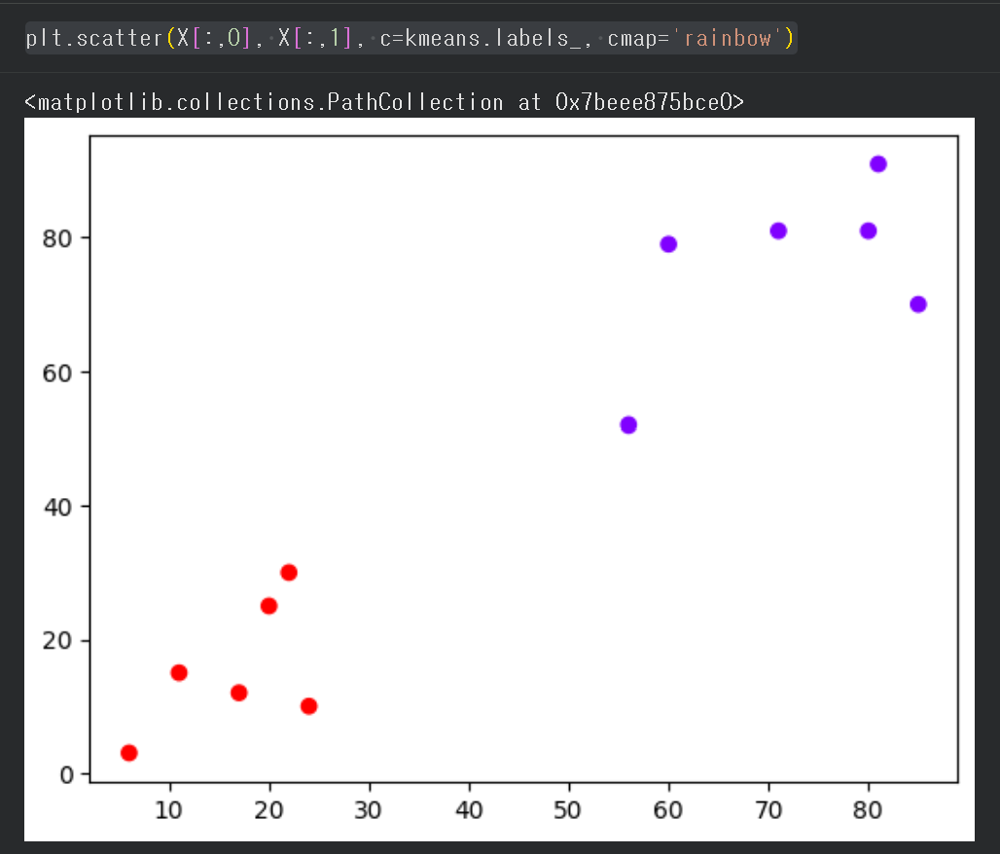

# KmeansClustering

Simple 2D clustering example using **KMeans (scikit-learn)**.  
It clusters 12 sample points into 2 groups and visualizes the result.

## What I did
- Created a 2D dataset (12 points)
- Trained **KMeans(n_clusters=2)**
- Printed cluster centers and labels
- Visualized clusters with matplotlib

## Results
### Raw points


### Clustered result


**Cluster centers**
- Example output:
  - `[72.17, 75.67]`
  - `[16.67, 15.83]`

## How to run
### Option 1) Python script
```bash
pip install -r requirements.txt
python src/kmeans_demo.py

